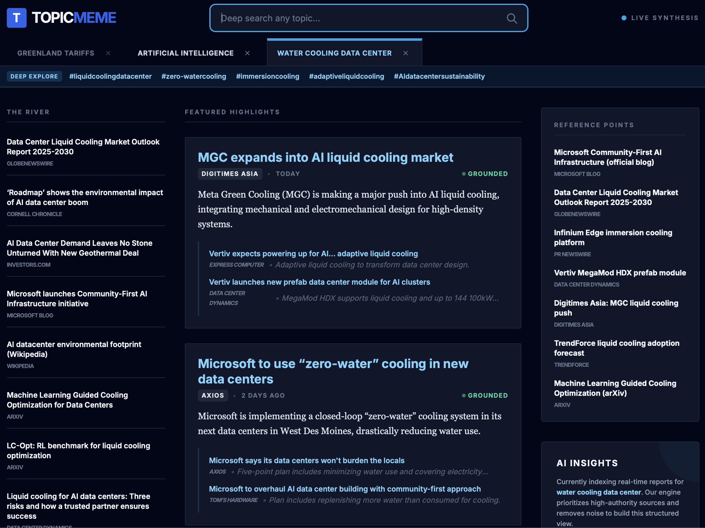

# TopicMeme

  

TopicMeme offers personalized search with supporting articles on specific topics, assembling a structured news view from authoritative sources.

## Features

- Topic-driven news aggregation with supporting sources
- Authority-boosted and recency-ordered highlights
- Related sources and quick links for deeper reading
- Trending topics to branch into adjacent searches
- Dark, focused UI with compact navigation

## UI Sections

- **Header:** brand, search input, and live status indicator
- **Topic Tabs:** open topics with close controls
- **Deep Explore Bar:** trending topics for quick pivots
- **The River:** condensed news stream (left column)
- **Featured Highlights:** full cards for top stories (center column)
- **Reference Points:** quick links and sources (right column)
- **AI Insights:** model context and status (right column)
- **Footer:** branding and resource links

## Run Locally

**Prerequisites:**  Node.js

1. Install dependencies:
   `npm install`
2. Copy `.env.example` to `.env.local` and set `VITE_OPENAI_API_KEY` to your OpenAI API key
3. Run the app:
   `npm run dev`

## Minimal Requirements

- Node.js 18+ (or 20+ recommended)
- OpenAI API key with access to the Responses API and web search
- Internet connection (for fetching live sources)
